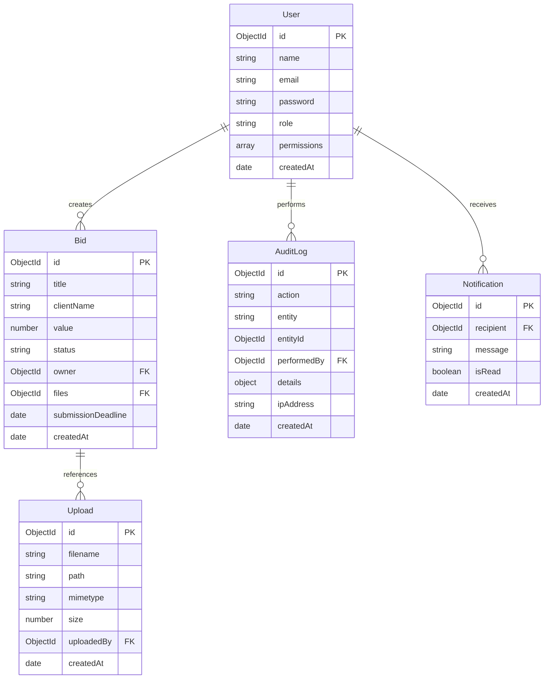

# 🏛️ BidSphere AI — Project Architecture

This document describes the architectural layout, data flows, security frameworks, and technical configurations of the BidSphere AI platform.

---

## 🗺️ High-Level Technical Structure

BidSphere AI is structured as a decoupled **Client-Server** web application using a modern JavaScript/Node.js stack.

```
                  ┌───────────────────────────────┐
                  │      React SPA Client         │ (Vite, Tailwind, Recharts)
                  └──────────────┬────────────────┘
                                 │ HTTP / JSON REST
                                 ▼
                  ┌───────────────────────────────┐
                  │      Express Gateway          │ (Helmet, Rate-Limiting, Sanitize)
                  └──────────────┬────────────────┘
                                 │ Route Guards
                                 ▼
                  ┌───────────────────────────────┐
                  │   Business Controller Layer   │ (JWT Authentication check)
                  └────────┬──────────────┬───────┘
                           │              │
             Mongoose API  │              │  Google SDK
                           ▼              ▼
              ┌──────────────┐          ┌───────────────────┐
              │ MongoDB Atlas│          │ Google Gemini Pro │
              └──────────────┘          └───────────────────┘
```

---

## 🖥️ Client-Side Architecture (Frontend)

The frontend is built as a single-page application (SPA) optimized for quick asset loading, premium interactions, and dashboard metric representation.

### 1. Global Context Providers
State is managed hierarchically using React Context Providers wrapped in `src/App.jsx`:
* **`ThemeContext`:** Stores and persists active color schemes (Dark Mode base: `slate-950`, Slate accents) in local storage, toggling CSS dark mode variables.
* **`AuthContext`:** Synchronizes session states, caches current JWT values, and tracks active user profile properties.
* **`NotificationContext`:** Coordinates system alert state hooks and real-time banner popups.

### 2. Guarded Routing Lifecycle
Paths are split into public pages (`/login`, `/signup`) and nested protected portals. The custom `ProtectedRoute.jsx` checks:
1. Whether user token is present (redirects to `/login` if unauthenticated).
2. Permission compatibility matching the user's role (redirects to `/unauthorized` if access is denied).

```
  [User Navigation Request]
            │
            ▼
   [Is Authenticated?] ─── No ───► Redirect to /login
            │ Yes
            ▼
 [Requires Permissions?] ── No ───► Render requested Page component
            │ Yes
            ▼
  [Has Permission?] ───── No ───► Redirect to /unauthorized
            │ Yes
            ▼
    Render Page Layout
```

### 3. Optimization and Component Structure
* **Dynamic Code Splitting:** Pages are loaded dynamically via React's `lazy` and `Suspense` loaders to split chunks and prevent oversized initial bundles.
* **Axios Interceptor (`src/api/apiClient.js`):** Intercepts outgoing requests to append `Authorization: Bearer <Token>` dynamically and processes `401 Unauthorized` responses to automatically clear local sessions.
* **Framer Motion Micro-Animations:** Page transitions and Kanban card reordering employ declarative animations, elevating the visual polish.

---

## ⚙️ Server-Side Architecture (Backend)

The server runs on **Express 5** built on **ES Modules (`import/export`)** to maintain parity with modern JavaScript modules.

### 1. Request Lifecycle & Middleware Pipelines
All incoming HTTP requests pass through a security and optimization chain before reaching route handlers:

```
  HTTP Request 
       │
       ▼
  [Helmet] ──────────────► Enforces secure HTTP headers (X-Frame-Options, etc.)
       │
       ▼
  [Mongo Sanitize] ──────► Strips query selectors to prevent NoSQL attacks
       │
       ▼
  [Gzip Compression] ────► Compresses response footprints for quick transfers
       │
       ▼
  [CORS Verification] ───► Permits only process-whitelisted client URLs
       │
       ▼
  [Rate Limiter] ────────► Throttles high-frequency connections (200 reqs/15m)
       │
       ▼
  [JWT Verification] ────► Decodes payload details and binds user to request context
       │
       ▼
  [Role Verification] ───► Enforces admin, manager, or sales authorization constraints
       │
       ▼
  [Route Controller] ────► Executes transactional database operations
```

### 2. Database Models & Relationships
We configure Mongoose to define strict schema rules for unstructured MongoDB documents:



### 3. Immutable Audit Log Triggers
Administrative accountability is maintained via automatic schema hooks. Whenever updates (`PUT`/`DELETE`) occur on the `Bid` model, an internal Mongoose middleware post-save hook intercepts the payload and creates a corresponding entry in the `AuditLog` collection, mapping:
* The previous document state.
* The newly committed values.
* The identifier details of the operator.

---

## 🤖 Google Gemini AI Core Integration

The integration with Gemini AI does not rely on third-party wrapper APIs, communicating directly using the official `@google/generative-ai` SDK.

### The Contextualization Pipeline
Raw generative models lack visibility into database collections. To achieve business-contextualized responses, the `aiController` implements a dynamic RAG-like (Retrieval-Augmented Generation) schema context building pipeline:

1. **Information Ingest:** The controller queries MongoDB to pull relevant pipeline metrics (e.g. total budgets, bid deadlines, active sales rep allocations).
2. **Context Compilation:** The database payload is serialized into a condensed JSON block.
3. **Prompt injection:** The JSON data is merged with a structured system prompt template containing instructions:
   ```text
   System Prompt: You are BidSphere AI, a business analyst dashboard agent. 
   Below is the JSON dataset of the active bidding portfolio. Analyze and generate 
   an executive summary:
   --------------------------------------------------
   DATABASE RECORDS: ${JSON.stringify(databaseRecords)}
   --------------------------------------------------
   Use markdown layout, flag compliance risks, and provide actionable recommendations.
   ```
4. **Execution:** The combined prompt is dispatched to `gemini-2.5-flash` or `gemini-2.5-pro` models to compute final outputs.
5. **Session Chat Memory:** Interactive chat requests use a session buffer database object that preserves previous user questions and AI outputs to provide true context-aware follow-up answers.
