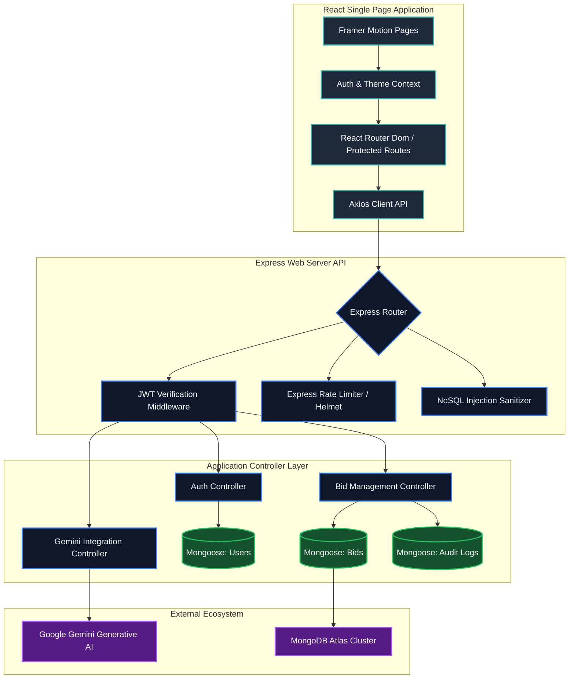

# 🏢 BidSphere AI — Enterprise Bid Lifecycle & Proposal Intelligence Platform

[](https://reactjs.org/)
[](https://nodejs.org/)
[](https://expressjs.com/)
[](https://www.mongodb.com/atlas/database)
[](https://deepmind.google/technologies/gemini/)
[](https://jwt.io/)
[](https://tailwindcss.com/)
[](https://www.framer.com/motion/)

BidSphere AI is a production-ready, enterprise-grade MERN stack software-as-a-service (SaaS) platform powered by Google's Gemini AI. Designed for medium to large enterprises, BidSphere AI revolutionizes the bid and proposal lifecycle—from initial RFP ingest and automated risk assessment to draft generation, collaborative approval workflows, real-time pipeline visualization, and secure audit tracking.

---

## 📖 Table of Contents
1. [Business Value & Context](#-business-value--context)
   - [Why BidSphere AI Matters](#why-bidsphere-ai-matters)
   - [Problem Statement](#problem-statement)
   - [Our Solution](#our-solution)
   - [Key Innovations](#key-innovations)
2. [Core Platform Features](#-core-platform-features)
3. [Architecture & Technical Flow](#-architecture--technical-flow)
4. [Project Folder Structure](#-project-folder-structure)
5. [Getting Started & Local Installation](#-getting-started--local-installation)
   - [Prerequisites](#prerequisites)
   - [Backend Configuration](#1-backend-configuration)
   - [Frontend Configuration](#2-frontend-configuration)
   - [Running the Platform](#3-running-the-platform)
6. [API & Security Design](#-api--security-design)
7. [AI Intelligence & Analytics Engine](#-ai-intelligence--analytics-engine)
8. [Production Deployment Guide](#-production-deployment-guide)
9. [Future Roadmap](#-future-roadmap)
10. [Contributing & Governance](#-contributing--governance)
11. [License](#-license)

---

## 💼 Business Value & Context

### Why BidSphere AI Matters
For enterprise B2B sales organizations, bidding for contracts is the lifeblood of revenue. However, large corporate bids are high-stakes, time-sensitive, and operationally fragmented. A single missing compliance criteria or miscalculated risk can result in multi-million dollar disqualifications or profit margin losses. BidSphere AI bridges this gap by introducing automated cognitive analysis and enterprise workflow rigor to the bid desk.

### Problem Statement
Traditional Request for Proposal (RFP) response processes suffer from:
* **High Operational Latency:** Manual review of 100+ page contracts takes days, leading to missed submission windows.
* **Information Silos:** Collaboration between Sales, Legal, Finance, and Technical teams is fragmented across email chains and shared spreadsheets.
* **Compliance & Legal Slip-ups:** Human error frequently overlooks obscure penalty clauses, strict service level agreements (SLAs), or liability exposures.
* **Inaccurate Pricing & Predictability:** Historical bidding performance data is rarely centralized, preventing data-driven pricing strategies.

### Our Solution
BidSphere AI provides a single, secure, central operating system for RFP ingest, triage, creation, approval, and execution. By marrying generative AI capabilities with rigid administrative controls, team Kanban workflows, and data-driven dashboards, organizations can respond to proposals **70% faster** while reducing legal and financial exposure.

```
       📥 Ingest RFP ─────► 🧠 Gemini AI Risk Scan ─────► 📊 Analytics Triage
                                                                 │
                                                                 ▼
       🚀 Team Delivery ◄─── ✅ Multi-Role Approvals ◄─── 📋 Kanban Workflow
```

### Key Innovations
* **Cognitive RFP Scanning (Gemini AI):** Automated document parser that extracts financial terms, deliverables, and compliance hazards directly from raw PDF/Word documents.
* **Granular Role-Based Access Control (RBAC):** Restricts actions based on authorization roles (Admin, Manager, Sales Developer) to protect proprietary bidding templates.
* **Database-Backed Conversational Agent:** An AI chat assistant that lets teams interrogate the active database of past proposals using natural language to extract historical pricing patterns.
* **Stateful Workflow Engine:** Interactive Kanban board driven by Framer Motion and `@hello-pangea/dnd` that triggers audit logs and user notifications upon card transitions.
* **Enterprise Security Measures:** Pre-integrated NoSQL injection prevention, security headers (Helmet), data compression, API rate-limiting, and comprehensive logging.

---

## ✨ Core Platform Features

| Module | Core Capabilities | Technologies Used |
| :--- | :--- | :--- |
| **Dashboard & Pipeline** | Live pipeline valuation, win-loss statistics, average deal size, interactive metrics. | React, Recharts, Lucide Icons |
| **AI Proposal Agent** | Risk Analysis, Executive Summaries, and live Database Chat query system. | `@google/generative-ai` (Gemini) |
| **Kanban Workspace** | Visual bid pipeline with drag-and-drop state transitions (Draft ➔ Review ➔ Approved ➔ Submitted). | React, `@hello-pangea/dnd` |
| **Auth & Security** | JWT-in-cookie authentication, password hashing, route guards, permission validation. | bcryptjs, jsonwebtoken, React Context |
| **Collaboration & Team** | Invites, permissions controls, performance tracking, real-time online status counters. | Express API, Mongoose |
| **Audit Trails** | Complete immutable logs tracking created, modified, approved, and deleted bids. | Mongoose (Schema Hook tracking) |
| **File Management** | Secure uploads of proposals, PDFs, and legal contracts with format validation. | Multer, Static asset server |

---

## 🏗️ Architecture & Technical Flow

BidSphere AI is designed using a decoupled Client-Server architecture. The server acts as a RESTful JSON API, while the client operates as an optimized single-page application (SPA).



For a comprehensive review of the design patterns, security frameworks, and system workflows, please refer to the **[Project Architecture Documentation](PROJECT_ARCHITECTURE.md)**.

---

## 📂 Project Folder Structure

Below is the verified structural layout of the BidSphere AI workspace:

```
ai-bid/
├── backend/
│   ├── config/             # Database connection & configurations
│   │   └── db.js
│   ├── controllers/        # Core business & controller logic
│   │   ├── aiController.js
│   │   ├── auditLogController.js
│   │   ├── authController.js
│   │   ├── bidController.js
│   │   ├── notificationController.js
│   │   ├── uploadController.js
│   │   └── userController.js
│   ├── middleware/         # Security, upload, sanitization, & JWT auth
│   │   ├── authMiddleware.js
│   │   ├── sanitizeMiddleware.js
│   │   └── uploadMiddleware.js
│   ├── models/             # Mongoose schemas (MongoDB Models)
│   │   ├── AuditLog.js
│   │   ├── Bid.js
│   │   ├── Notification.js
│   │   ├── Upload.js
│   │   └── User.js
│   ├── routes/             # REST API endpoint routers
│   │   ├── aiRoutes.js
│   │   ├── auditLogRoutes.js
│   │   ├── authRoutes.js
│   │   ├── bidRoutes.js
│   │   ├── notificationRoutes.js
│   │   ├── uploadRoutes.js
│   │   └── userRoutes.js
│   ├── services/           # External integration services
│   ├── uploads/            # Local scratch storage for multipart assets
│   ├── utils/              # Helper utility functions
│   ├── server.js           # Express application entry point
│   └── package.json
└── frontend/
    ├── public/             # Static public assets
    ├── src/
    │   ├── api/            # Axios interceptor & endpoint definitions
    │   ├── assets/         # CSS styles and structural assets
    │   ├── components/     # Reusable layout and modular components
    │   │   ├── common/
    │   │   └── layout/     # Sidebar, Header, Dashboard Wrapper
    │   ├── context/        # Global context (Auth, Theme, Notification)
    │   ├── hooks/          # Custom hooks (e.g. useAuth, useTheme)
    │   ├── pages/          # View route page components
    │   │   ├── ai-insights/
    │   │   ├── analytics/
    │   │   ├── audit-logs/
    │   │   ├── auth/       # Login, Register, Unauthorized views
    │   │   ├── bids/       # Bid listing & creation pages
    │   │   ├── dashboard/  # Admin metric panels
    │   │   ├── notifications/
    │   │   ├── settings/
    │   │   ├── team/       # Team roster and access controls
    │   │   └── workflow/   # Framer Motion Kanban Board
    │   ├── routes/         # Router guards & path lists
    │   ├── utils/          # Formatting helpers, PDF/Excel utilities
    │   ├── App.jsx         # App router mount & global provider wrapping
    │   ├── main.jsx        # DOM render wrapper
    │   └── index.css       # Tailwind base configuration
    ├── vite.config.js      # Build bundler configurations
    └── package.json
```

---

## 🚀 Getting Started & Local Installation

### Prerequisites
* **Node.js** (v18.x or v20.x recommended)
* **npm** (v9.x or higher)
* **MongoDB Atlas Account** (or local MongoDB Community server)
* **Google Gemini API Key** (obtained via Google AI Studio)

---

### 1. Backend Configuration

Navigate to the `backend` directory and install all required system packages:
```bash
cd backend
npm install
```

Create a new file named `.env` inside the `backend` root folder and configure the following parameters:
```env
# Server Details
PORT=5000
NODE_ENV=development

# Database Setup
MONGO_URI=mongodb+srv://<username>:<password>@cluster0.mongodb.net/bidsphere?retryWrites=true&w=majority

# Security Configuration
JWT_SECRET=your_super_secure_long_random_jwt_secret_hash_here
JWT_EXPIRE=7d

# Google Gemini API
GEMINI_API_KEY=AIzaSyYourGeminiApiKeyHere

# Cross-Origin Whitelist (Use comma separation for multiples)
CLIENT_URL=http://localhost:5173,http://localhost:3000
```

Start the backend in development hot-reload mode:
```bash
npm run dev
```
The server will boot up and establish a connection to your MongoDB Cluster. You should see:
```text
Server running in development mode on port 5000
MongoDB Atlas Connected successfully...
```

---

### 2. Frontend Configuration

Navigate to the `frontend` directory and install all client dependencies:
```bash
cd ../frontend
npm install
```

Create a `.env` file inside the `frontend` folder to point the Axios client to the API port:
```env
VITE_API_URL=http://localhost:5000/api
```

Start the Vite development web server:
```bash
npm run dev
```
Open your browser and navigate to: **`http://localhost:5173`** to access the dashboard portal.

---

## 🔒 API & Security Design

All operations outside of authentication are secured behind JSON Web Tokens (JWT) verified via request headers or cookies. Additionally, the backend implements:
* **Rate Limiting:** Maximum 200 requests per 15-minute window per IP to avoid denial-of-service vectors.
* **NoSQL Injection Blockers:** Sanitizes incoming requests to prevent queries injected with `$ne`, `$gt` Mongoose operators.
* **Access Level Policies:** Custom Express middleware `checkRole('admin', 'manager')` to block unauthorized users.

| Method | Endpoint | Access Level | Description |
| :--- | :--- | :--- | :--- |
| **POST** | `/api/auth/signup` | Public | Registers user and sets permissions |
| **POST** | `/api/auth/login` | Public | Returns authentication token |
| **GET** | `/api/auth/me` | Protected | Retrieves details of the logged-in session |
| **GET** | `/api/bids` | Protected | Fetches bids (Sales sees owned; Admin sees all) |
| **POST** | `/api/bids` | Admin/Manager/Sales | Submits a new bid object |
| **PUT** | `/api/bids/:id` | Protected | Modifies data details of a bid entry |
| **DELETE** | `/api/bids/:id` | Admin/Manager | Permanently drops a bid |
| **GET** | `/api/ai/project-summary`| Protected | Generates AI portfolio summary report |
| **GET** | `/api/ai/risk-analysis` | Protected | Audits database collections for RFP risk factors |
| **POST** | `/api/ai/chat` | Protected | Interactive chat directly queryable on active bids |
| **GET** | `/api/audit-logs` | Admin Only | Inspects all administrative system actions |

For request/response payload samples, review the **[REST API Documentation](API_DOCUMENTATION.md)**.

---

## 🧠 AI Intelligence & Analytics Engine

BidSphere AI uses the **Google Gemini Pro** model (`@google/generative-ai`) to inject cognitive capabilities directly into the bid lifecycle.

```
   ┌───────────────────────────────────────────────────────────────┐
   │                       Google Gemini Pro                       │
   └───────────────────────────────┬───────────────────────────────┘
          ▲                        │                        ▲
          │ 1. Active Context      │ 2. Structured JSON     │ 3. User Query
          │    MongoDB Bids        │    Report Payload      │    Natural Language
   ┌──────┴────────┐       ┌───────▼───────┐        ┌───────┴───────┐
   │ Portfolio Summary│    │ Risk Audit Engine│     │ Database Chat │
   └───────────────┘       └───────────────┘        └───────────────┘
```

1. **Portfolio Summarization:** Aggregated pipeline numbers are analyzed, identifying velocity, bottlenecks, and win-probability ratios.
2. **Contextual Risk Audits:** Scans uploaded proposals for contractual hazards, liability limits, and performance penalties.
3. **Database Chat:** Direct querying on bids. Ask *"Which bids in 'Review' state have a budget exceeding $500,000?"* and the AI compiles responses dynamically based on real-time collection schemas.

---

## 📊 Visual Dashboards & Analytics
BidSphere utilizes **Recharts** to display real-time metrics with custom HSL theme integrations. The dashboard includes:
* **Interactive Funnel Charts:** Showing transition conversion from Draft to Final Submission.
* **Volume Over Time:** Area charts measuring monthly pipeline value.
* **Win-Loss Metrics:** Donut charts illustrating bid success rates per agent.

---

## 🚀 Production Deployment Guide
This platform is fully optimized for containerized cloud deployment.
* **Frontend:** Hosted on **Vercel** or **Netlify** with automatic rewrite fallback configurations.
* **Backend:** Deployed on **Render**, **Heroku**, or **AWS ECS** container frameworks.
* **Database:** Hosted on **MongoDB Atlas** with IP whitelisting rules.

For step-by-step CI/CD pipeline builds and host deployment files, consult the **[Production Deployment Guide](DEPLOYMENT_GUIDE.md)**.

---

## 🔮 Future Roadmap
- [ ] **RFP Parser OCR Integration:** Deep optical character recognition to instantly ingest scanned physical contract papers.
- [ ] **Collaborative Live Editing:** Real-time collaborative document editor for proposals using WebSockets.
- [ ] **Automated Pricing Engine:** Predictive ML pricing models suggesting ideal bid values based on win histories.
- [ ] **Slack & MS Teams Hookups:** Push automated notifications for approvals to messaging channels.

---

## 👥 Contributors & Governance
Interested in contributing to BidSphere AI? Please review the **[Contribution Guidelines](CONTRIBUTING.md)** for coding standards, pull request processes, and branching strategies.

* **Project Lead / Lead Engineer:** [Ridhi Jindal](https://github.com/RidhiJindal)
* **Core Contributors:** Open to contributions from the developer community!

---

## 📄 License
This project is licensed under the **MIT License** - see the [LICENSE](LICENSE) file for details.

---

*Built with ❤️ to optimize enterprise productivity and automate contract acquisition workflows.*
